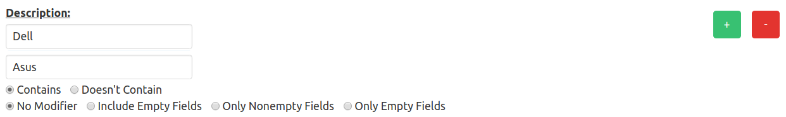

# Filtering

If the filtering options in [Searching, Sorting and Selecting](searching,%20sorting%20and%20selecting.md) are not powerful enough for a task, the **Advanced Filter** is more complicated but far more capable of generating advanced queries. The advanced filter can be accessed by clicking the 'Advanced Filter' button to the right of the search bar.

## Overview

* [Text](#text)
* [Ranges](#ranges)
* [Dates and Times](#dates)
* [Multiple Ranges or Search Parameters](#multiple)
* [Search Modifiers](#modifiers)
* [Additional Options](#options)
* [Applying the Filter](#apply)

## Text 

Text fields such as 'Description' have a single field to filter, some search parameter like 'Dell' or 'Laptop'. Running the query will then match any item with 'Dell' or 'Laptop' in that field. Changing the 'Contains' option to 'Doesn't Contain' will inversely match any item that does not have 'Dell' or 'Laptop' in that field.

## Ranges 

Normal ranges like 'Inventory Number' allow the user to enter a lower bound and an upper bound on the given field. If a user entered '0' as their lower bound and '1000' as their upper bound, the query would match all items with that field between 0 and 1000 (inclusive). Changing the 'Between' option to 'Not Between' will inversely match any item that is not between 0 and 1000.

##### Leaving one bound blank

Leaving one of the two bounds blank will trigger special behavior depending on which bound is left blank. If the left bound is left blank, the right bound is treated as a maximum value to match. Inversely, leaving the right bound blank will make the left bound a minimum value to match.

Ex. Leaving the left bound blank and setting the right bound to '1000' will match any items whose given field is smaller than or equal to 1000.

## Dates and Times 

Dates offer two different ways to be filtered: By range and by days ago. By days ago is useful in creating reports if the date should be relative to today's date (see [Reporting](reporting.md)).

##### By Range

Filtering dates by range works identically to normal ranges ([seen above](#ranges)). Additionally, dates can be entered manually or chosen through a calendar widget by clicking on the calendar icon.

##### By Days Ago

Filtering dates by the number of days ago will match any items whose given field's date was x days ago or more. Switching the search option below from 'Older Than' to 'Younger Than' will match any items whose given field's date was x days ago or less.

Ex. Setting days ago to 1825 (5 years) on 'Older Than' will give all the items in which the given field's date is 5 years old or older.

## Multiple Ranges or Search Parameters 

The green '+' and red '-' button on the right of each field allows the user to add multiple ranges or other search parameters to their query. For example, to match any items that have a description of 'Dell' or 'Asus', a user would scroll to the 'Description' field, hit the green '+' once, and enter each value as shown below.

## Search Modifiers 

At the bottom of each field filter are the search modifiers. These give the user additional control over the query. There are four search modifiers available:

* No Modifier
  * Default
  * No additional behaviors
* Include Empty Fields
  * Items will match if the given field is empty
* Only Nonempty Fields
  * Only items where the given field **is empty** will match
* Only Empty Fields
  * Only items where the given field **is not empty** will match

## Additional Options 

At the bottom of the filtering page, there are a couple extra options:

* Include Decommissioned
  * Include decommissioned items in results
* Include Deleted
  * Include deleted items in results

Any field can also be marked as case sensitive if desired.

## Applying the Filter 

To apply the filter, hit the 'Apply Filter' button at the bottom of the form. This will take the user back to the home page, with only the matching items displayed and selected.

Hitting the 'Create Report' button will take the user to the report creation page (see [Reporting](reporting.md)).

> Reporting requires Normal User Authorization (see [User Management](user%20management.md))
